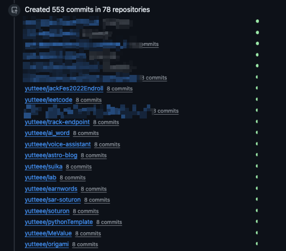

## はじめに

自分のGitHubアカウントから身に覚えのないcommitが大量に作成されていました。




これまで経験したことのない焦りの中、パスワード変更やトークン無効化など、その場でできる限りの対応を行いました。

改めて、ご迷惑をおかけした関係者の皆様、本当に申し訳ありませんでした。

## 何が起こったのか？

[Shai-Hulud 2.0](https://www.trendmicro.com/ja_jp/research/25/k/shai-hulud-2-0-targets-cloud-and-developer-systems.html)と呼ばれるnpmサプライチェーン攻撃の被害を受けていました。

実際に私が受けた被害は以下の通りです。


- アクセス権のある全リポジトリのREADMEが改ざんされた（[同様の被害報告](https://github.com/orgs/community/discussions/180432)）
- privateリポジトリがpublicに変更された
- 自分のアカウントに新しいリポジトリが作成され、環境変数やAPIキーなどの機密情報が外部から閲覧可能な状態で公開された

### Shai-Hulud 2.0とは

一言で言うと、信頼されているnpmパッケージにマルウェアを仕込み、インストールした開発者の認証情報を盗み取る攻撃です。

1. 正規パッケージのメンテナが乗っ取られ、マルウェア入りのバージョンが公開される
2. 開発者が`npm install`を実行すると、`preinstall`スクリプトでマルウェアが自動実行される
3. マルウェアがローカルの認証情報を収集し、攻撃者のリポジトリに送信する

さらに、被害者がnpmパッケージのメンテナだった場合、.npmrcから盗んだnpmトークンを使ってそのパッケージにも悪意あるバージョンが公開され、連鎖的に被害が広がります。


詳細は、[Shai-Hulud 2.0キャンペーンがクラウドと開発者エコシステムを標的に](https://www.trendmicro.com/ja_jp/research/25/k/shai-hulud-2-0-targets-cloud-and-developer-systems.html)をご覧ください。

### 私の感染経路

私の場合、npm経由ではなくVSCode拡張機能経由での感染でした。

2年ほど前の開発で導入した拡張機能「vs-asyncapi-preview」に、悪意のあるバージョンがpushされていました。Cursorを起動した際、拡張機能が自動アップデートされるタイミングで感染したようです。

詳細については、[AsyncAPI公式ブログのポストモーテム記事](https://www.asyncapi.com/blog/shai-hulud-postmortem)で解説されています。

## 攻撃を受けての反省

npmサプライチェーン攻撃については、会社でも情報共有されており知識としては知っていました。しかし、自分個人には関係のない話だろうと高をくくってしまっていました。

実際に攻撃を受け、過去に一緒に開発したメンバーや所属しているOrganizationのメンバーにまで迷惑をかけてしまいました。自分のエンジニアとしての技術力の無さと意識の低さを痛感しました。

- CLIに慣れておらず、どう調査するべきかも手探りな状態
- トークンの保存場所すら把握できていないなど、普段の管理が杜撰だった
- 対応策をなんとなく知っているだけで、何も身についていなかった

この経験を真摯に受け止め、開発環境のセキュリティ周りを見直すことにしました。

## 行った対策

### 1. dev containerの導入

今回の感染の根本原因は、**PC全体に影響が及ぶグローバルな環境で開発していた**ことにあります。2年前のプロジェクトで使った「vs-asyncapi-preview」という拡張機能を放置していたことで、全プロジェクトに影響が及びました。

Shai-Hulud 2.0の本来の攻撃経路であるnpm経由の場合も同様です。ホストマシンのターミナルで直接`npm install`を実行すると、先述した攻撃メカニズムの通り、preinstallスクリプトが自動実行されます。悪意のあるパッケージが含まれていた場合、環境変数に保存された全プロジェクトの機密情報が一度に流出してしまいます。

この問題を解決するために、**開発環境の分離（Isolation）**を徹底することにしました。dev containerを導入することで、プロジェクトごとに独立したコンテナ環境を構築します。

- **影響範囲の限定化**: 万が一攻撃を受けても、被害はそのコンテナ内に閉じ込められる
- **プロジェクト固有の依存関係管理**: 拡張機能やツールをプロジェクトごとに管理できる

今回の経験を機に、今後のあらゆる開発でDev Containerを使用することにしました。これまでコンテナ技術にしっかりと向き合ってこなかったため、学び直しとしてdev containerの具体的な設定方法に関して改めて記事にする予定です。

### 2. 1Passwordでのクレデンシャル管理

`~/.ssh`にSSH秘密鍵を、`~/.zshrc`にPAT（Personal Access Token）を平文で保存していました。今回のようなサプライチェーン攻撃を受けると、これらの認証情報は一瞬で盗まれてしまいます。

SSHやHTTPSでの認証は「自分が使っている限り安全」というだけであり、ローカル環境に侵入されてしまえばワンパンです。この状況を解消するため、クレデンシャルを平文で保存することをやめ、1Passwordでの一元管理に移行しました。

1Passwordには[SSHエージェント機能](https://developer.1password.com/docs/ssh/get-started/)があり、SSH秘密鍵を安全に管理できます。設定後の`~/.ssh/config`は以下のようになります。

```
Host *
  IdentityAgent "~/Library/Group Containers/2BUA8C4S2C.com.1password/t/agent.sock"
```

このファイルには機密情報が一切含まれていません。実際の秘密鍵は1Password内で暗号化されて保存されており、`git push`などのSSH接続時にはTouch IDによる生体認証が必要になります。たとえマルウェアが`~/.ssh/`ディレクトリを読み取ったとしても、得られるものは何もありません。

今後はあらゆる認証情報も順次1Passwordへ移行していく予定です。

### 3. pnpmの設定見直し

私の感染経路は拡張機能起因でしたが、npm周りのセキュリティ管理も杜撰でした。

npmパッケージの`preinstall`や`postinstall`スクリプトは、パッケージが安全性の評価を受ける前に、開発者の全権限でインターネット上の任意のコードを実行します。悪意あるバージョンが公開されると、`npm install`を実行しただけで感染してしまいます。

npmパッケージをインストールすることに危険性があることを認め、正しく運用する必要があります。pnpmで用意されているセキュリティ機能を最大限活用することにしました。

具体的には以下の設定を適用しました。

```yaml
# pnpm-workspace.yaml
strictDepBuilds: true
onlyBuiltDependencies:
  - '@biomejs/biome'
  - '@swc/core'
  - esbuild
  - sharp

minimumReleaseAge: 10080 # 7日

trustPolicy: no-downgrade

blockExoticSubdeps: true
```

詳細は[pnpmのサプライチェーンセキュリティに関するドキュメント](https://pnpm.io/supply-chain-security)および[pnpm公式ブログの解説記事](https://pnpm.io/blog/2025/12/05/newsroom-npm-supply-chain-security)をご参照ください。

#### 3.1. ライフサイクルスクリプト管理

`strictDepBuilds: true`を設定すると、pnpmは`preinstall`や`postinstall`といったスクリプトを持つパッケージを検出し、インストールを中断します。

これにより、どのパッケージにスクリプトがあるか特定でき、スクリプトの内容を調査した上で実行を許可するかどうかユーザーが判断できます。許可するパッケージは`onlyBuiltDependencies`に追加することで、そのパッケージのみスクリプト実行が許可されます。

#### 3.2. リリース・クールダウン

新しいパッケージが公開されてすぐに利用するのではなく、一定期間待ってから利用することで、悪意のあるパッケージが混入するリスクを減らすことができます。`minimumReleaseAge`で公開からの経過時間を指定できます。

常に最新のものが最良とは限りません。時間が経った方が、コミュニティが問題を発見しやすいです。

#### 3.3. Trust Policy

npmはパッケージの公開方法に応じて3つの信頼レベルを区別しています。

- **Trusted Publisher**: GitHub ActionsでOIDCトークンとnpm provenanceを使用して公開
- **Provenance**: CI/CDシステムからの署名付き証明
- **No Trust Evidence**: ユーザー名/パスワードまたはトークン認証で公開

`trustPolicy: no-downgrade`を設定すると、新しいバージョンの認証レベルが古いバージョンよりも低い場合、pnpmはインストールを拒否します。

攻撃者が開発者のアカウントを乗っ取り、不正なパッケージを公開した場合、CI/CDシステムからの証明（provenance）がないため信頼レベルが低下します。この設定により、そのような攻撃の影響を受けないようにできます。

#### 3.4. 間接的な依存関係のブロック

`blockExoticSubdeps: true`を設定すると、間接的な依存関係（transitive dependencies）がGitリポジトリやURLを直接参照している場合にインストールをブロックします。正規のnpmレジストリを経由しない依存関係は、検証が困難なため危険性が高いです。

## まとめ


npmサプライチェーン攻撃の存在は知っていましたが、自分には関係ないと思い込み、何の対策も講じていませんでした。その結果、攻撃を受けてから慌てて対応することになり、周囲にも迷惑をかけてしまいました。

今回の攻撃を受けて、以下の3つの対策を実施しました。

1. **dev containerの導入**: プロジェクトごとに環境を分離し、被害の影響範囲を限定した
2. **1Passwordによるクレデンシャル管理**: 認証情報を平文でファイルに保存せず、生体認証で保護した
3. **pnpmのセキュリティ設定**: pnpmの設定を活用し、サプライチェーン攻撃のリスクを低減した


対策を行うことで、なんとなく聞いたことがあった知識を自分の経験として身につけることができました。今後も積極的に新しい技術や対策を取り入れ、幅広い知識をしっかり身につけていきたいと思います。
