<!-- _class: title -->

# オレオレデザインシステムを作る

2026/05/28

---

<!--  _class: strong -->

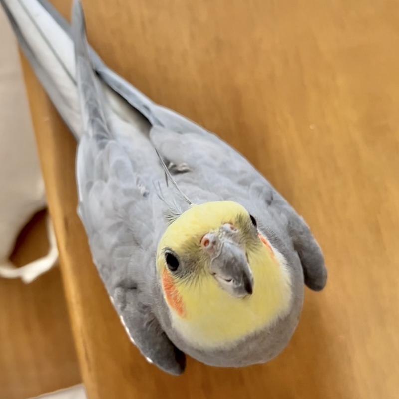

## ゆってぃー

- 新卒2年目
- フロントエンドとデザインが好き

noshに飽きて食事が迷走しています。
ロケットナウと長谷川あかりを信じてます。

---

## やったこと

[OriCube](https://ori-cube.com/)というプロダクトに、
デザインシステムを導入しました。

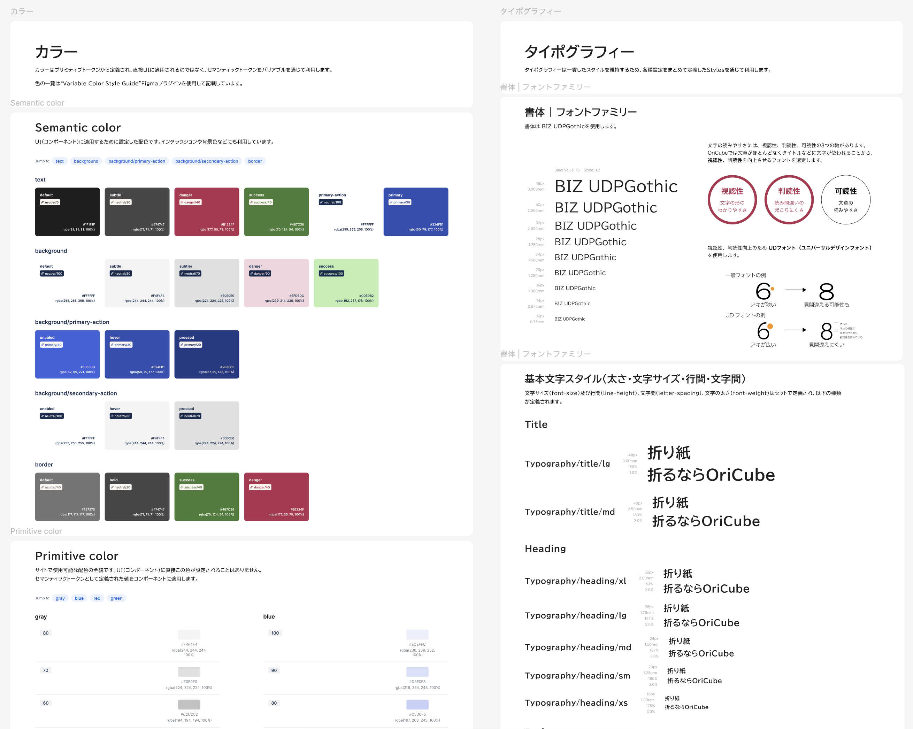

---

## 目次

- 開発背景
- デザインシステムについて知る
- デザイントークン
- タイポグラフィ
- 実装コード連携
- 振り返りと今後

---

<!--  _class: strong -->

## 開発背景

---

## OriCube

### 折り紙の折り方をわかりやすく伝えるアプリ

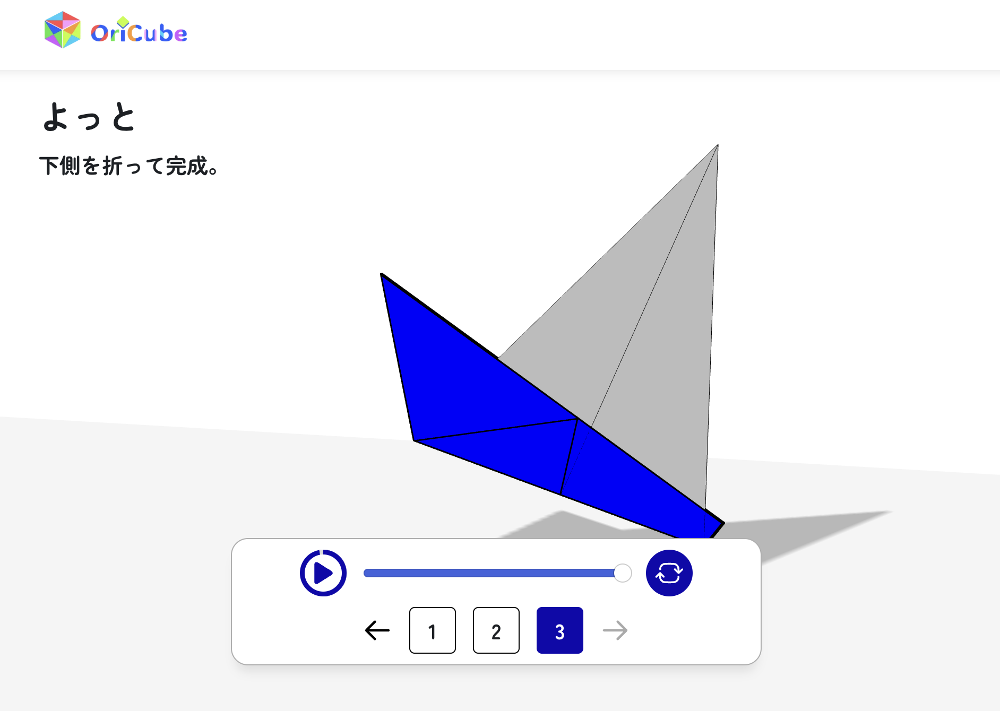

---

## 開発メンバー

### 大学時代の同期4人

- 🦜（私）：社会人2年目
- 🍅：社会人2年目
- 🐕：大学院2年
- 🌰：大学院2年

---

## 起こっていたこと

### 微妙に異なるコンポーネントが乱立

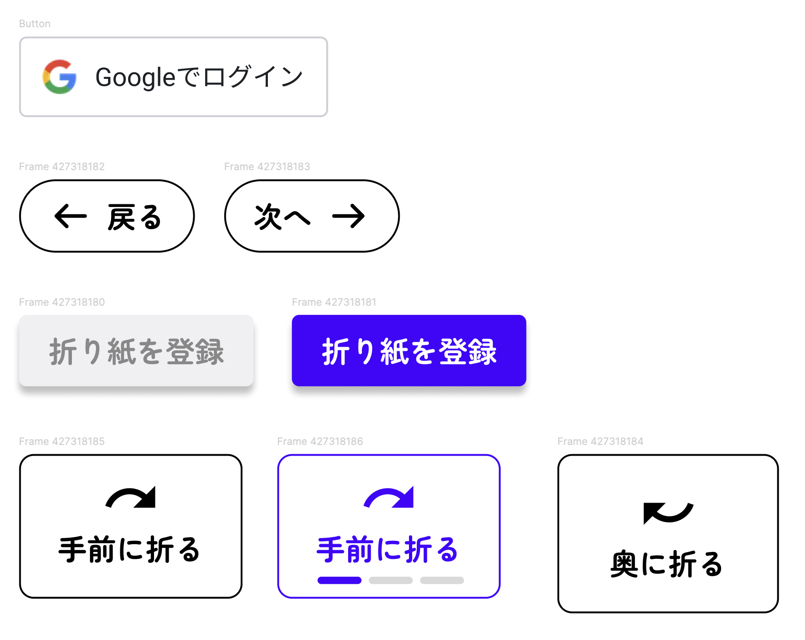

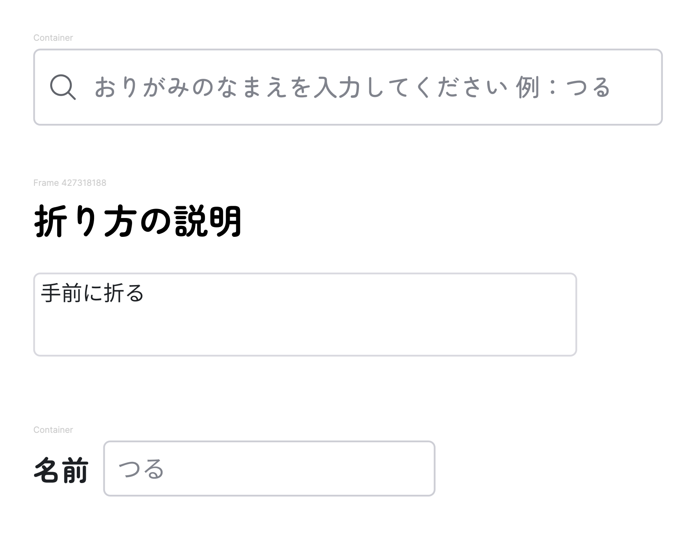

---

## なぜこんなことが起こった？

### 各々が好き勝手デザインして開発してた

- 🦜（私）：デザインやりたい！
- 🍅：デザインやりたい！
- 🐕：デザインやりたい！
- 🌰：（頼んだ！）

---

## 課題感

- 見た目の一貫性がない
- 毎回個別で作るのは無駄

---

## デザインシステムをつくろう！！

ということを1年前くらいに思って開発が止まってました。

---

## 勝手に作っちゃおう

- 最近興味が湧いているのでやりたい
- 開発止まってるしええやろ

Figma for デザインシステムという書籍を参考に作成しました。

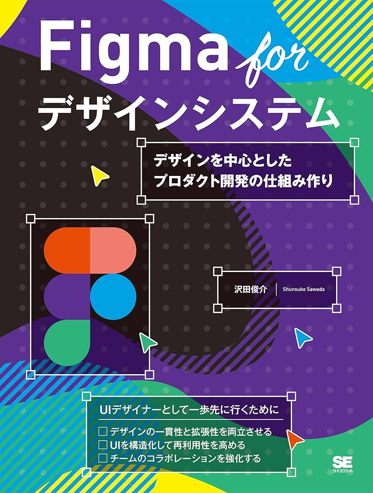

---

<!--  _class: strong -->

## デザインシステムについて知る

---

<!-- ## デザインシステムとは？

> デザインシステムは、再利用可能なコンポーネント、ガイドライン、アセットの集合であり、デザインプロセスの一貫性と効率性を維持するのに役立ちます。デザイナー、開発者、ステークホルダーの信頼できる唯一の情報源として機能します。

[デザインシステムの基本: デザインシステムの始め方](https://www.figma.com/ja-jp/reports/getting-started-with-design-systems/)

--- -->

## デザインシステムのメリット

### 一貫性のあるUIを効率的に作れる

- **一貫性**：誰が作っても同じ見た目になる
- **開発速度**：既存パーツを組み合わせるだけ
- **共通言語**：「あの青いボタン」→「Primary Button」

---

## デザインシステムの構成要素

どこまでをデザインシステムと呼ぶかは組織によって変わるそう

- **デザイン原則**：デザインの考え方や思想を記述したもの
- **スタイルガイド**：色、タイポグラフィなどUIを構成する要素をまとめたもの
- **パターンライブラリ**：コンポーネントなどの再利用可能な要素をまとめたもの

ライティングガイド、実装コード、ブランドガイドライン、イラストレーション、アニメーション、...。

---

## とりあえず作ってみよう！

---

<!--  _class: strong -->

## デザイントークン

---

## デザイントークンとは

### デザインの最小単位に名前をつけたもの

- 色・余白・タイポグラフィなどの値を変数として定義
- デザインと実装をつなぐ共通言語になる

最も基本的な要素である色について整理していく。

---

## プライマリーカラー

### サイトのトンマナを確定する色

揺れがあったが
一番使われてた`#324FB1`に統一

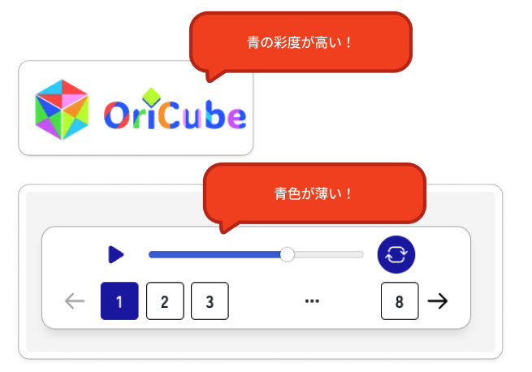

---

## 階調

### 色の濃淡の変化

ボタンなどのインタラクションの表現などに必要。

[Color Shades](https://www.figma.com/community/plugin/929607085343688745/color-shades) Figmaプラグインでいい感じに作成。

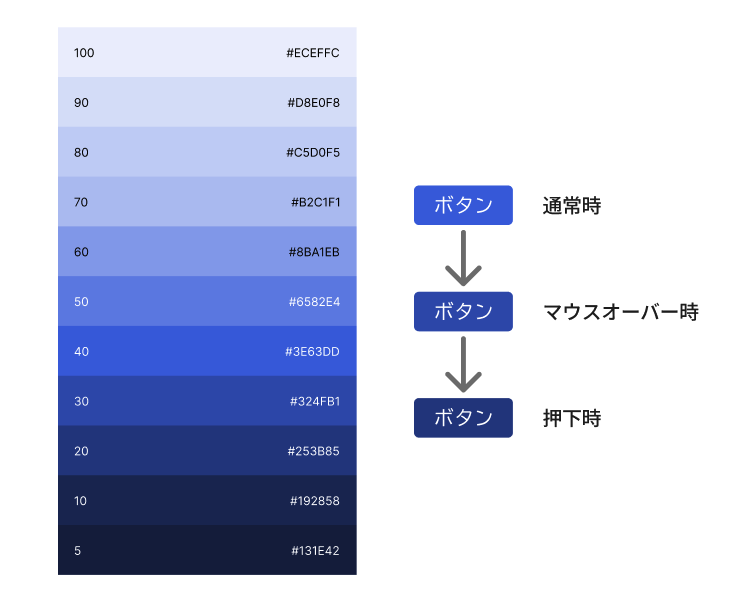

---

## その他の色も定義

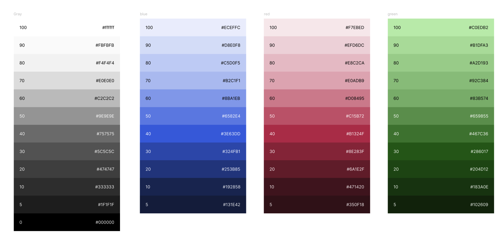

---

## コントラストグリッド

コントラスト（文字色と背景色の明るさの差）を一覧で見る。

WCAGの達成基準（4.5：1以上）に準拠する組み合わせを選ぶ。

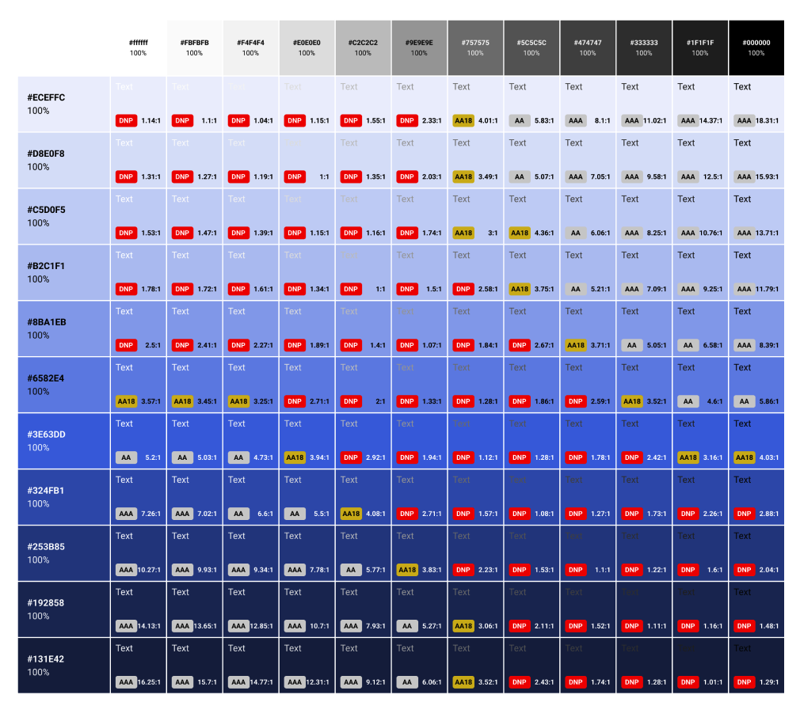

---

## カラートークン定義

`blue/30`のように名前をつけることでおおよその色を想像できる。

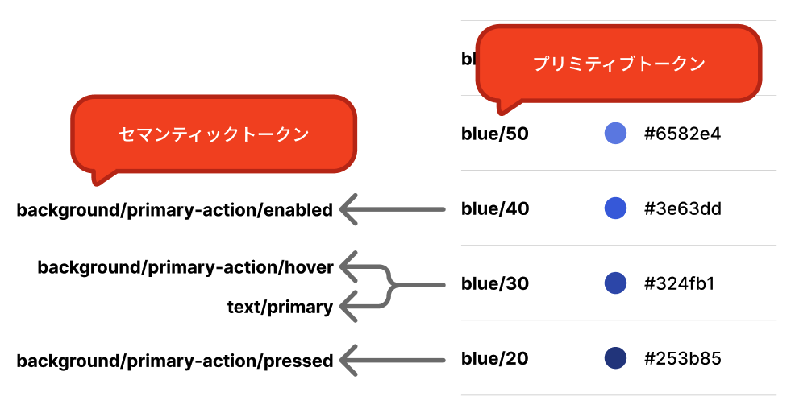

`text/primary`のようにすると色の役割も表現できるため、
迷わずデザインを進めることができる。

---

## セマンティックカラー定義

組み合わせた場合のコントラスト比を考慮しつつ定義

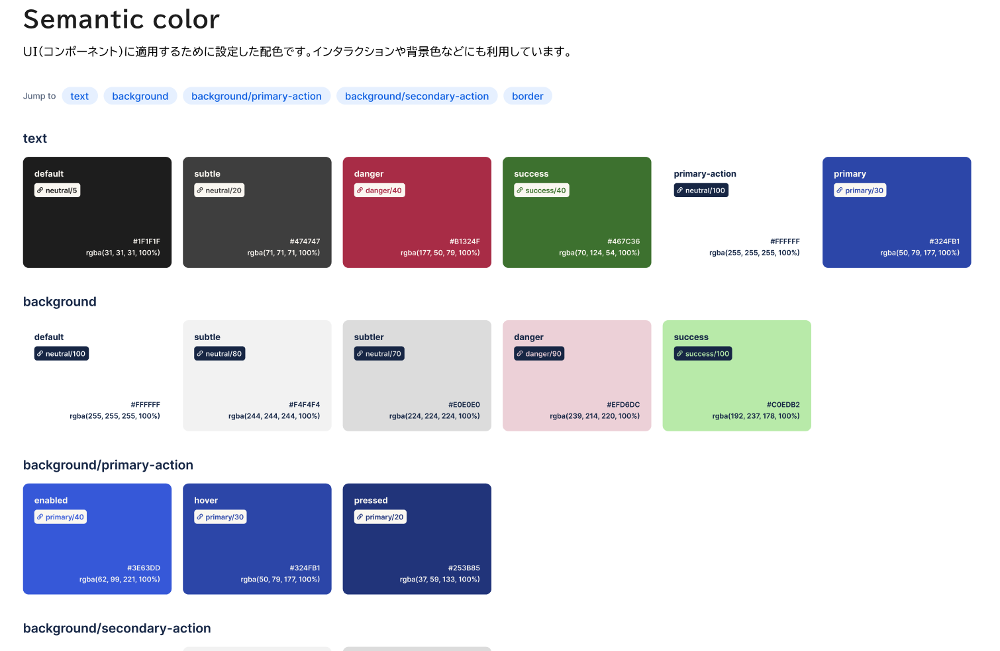

---

<!--  _class: strong -->

## タイポグラフィ

---

## 読みやすいフォント

文字の読みやすさには、視認性、判読性、可読性の3つの軸がある。

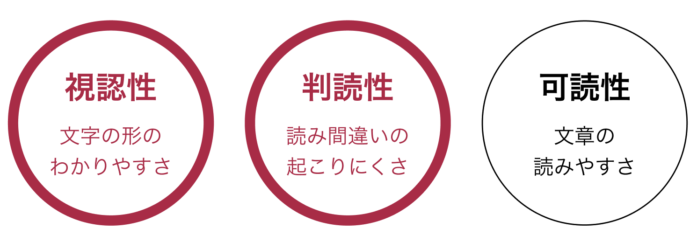

OriCubeでは文章がほとんどなくタイトルなどに文字が使われることから、
**視認性、判読性**を向上させるフォントを選定する。

---

## 視認性・判読性の高いフォント

### BIZ UDPGothic を選定した

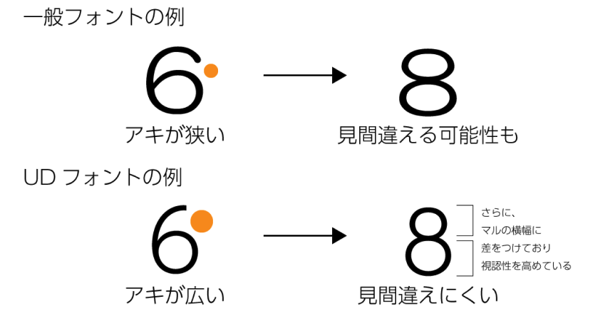

---

## セマンティックフォント

カラーと同様に、組み合わせと役割を定義した。

 

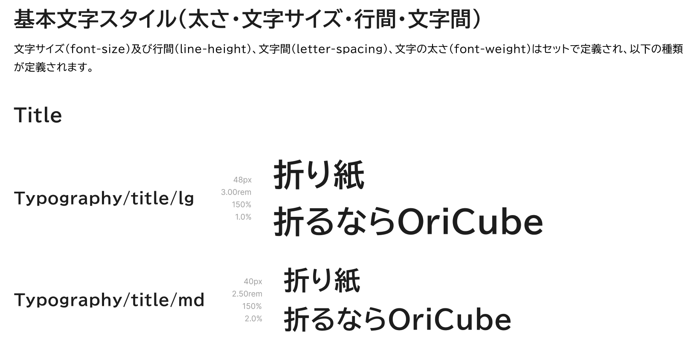

---

## その他のトークン

影、角丸、余白なども同様に
階調を作り一貫性が出るように定義

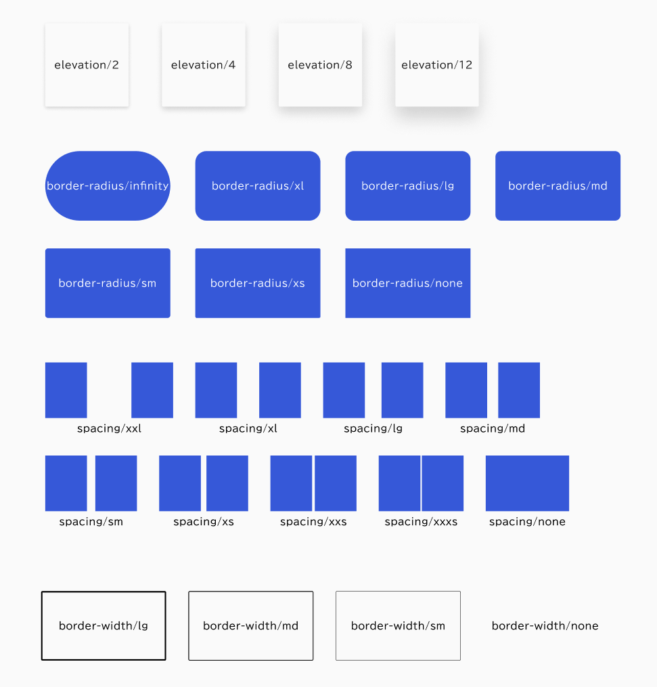

---

<!--  _class: strong -->

## コンポーネント

---

## コンポーネント整理

今使われているコンポーネントを洗い出して、あたりをつけていく。

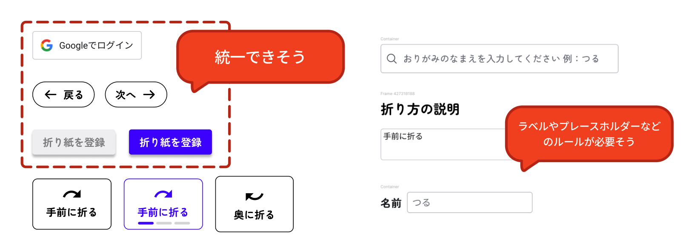

---

## Button定義

汎用的なボタンコンポーネントを作成した。

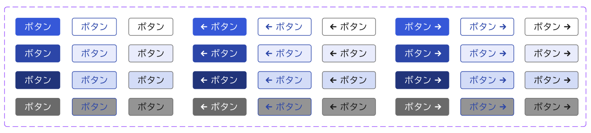

全ての状態を定義すると上記のようになるが、
一個一個作るのは大変なので...

---

## バリアントの使用

### React ComponentでいうProps

Figmaでも汎用性の高いコンポーネントを作ることができる

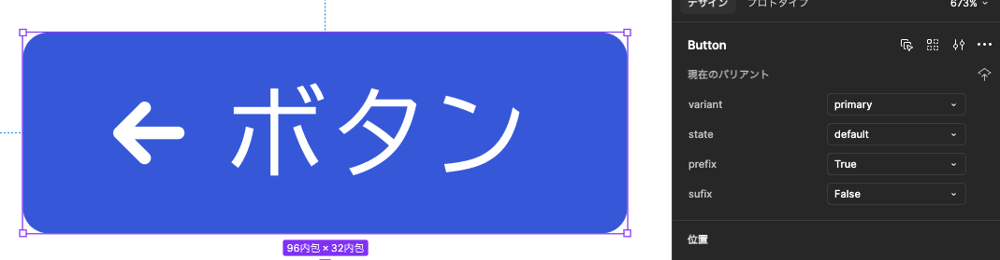

---

## 使用原則の作成

曖昧だったルールを明示的に記述。

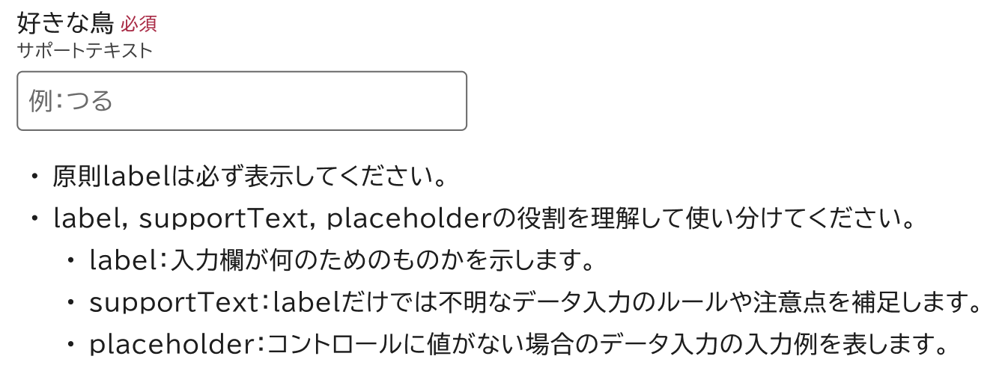

---

<!--  _class: strong -->

## 実装コード連携

---

## デザイントークンの連携

Variablesに登録したデザイントークンはプラグインでcss変換できる

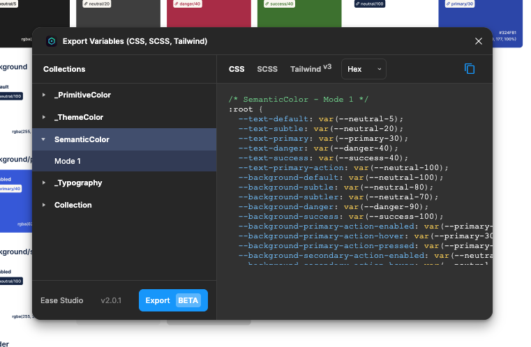

(CIがんばれば自動更新とかもできるっぽい、やってみたい)

---

## コンポーネント実装

Storybook上に必要なパターンを全ておこす

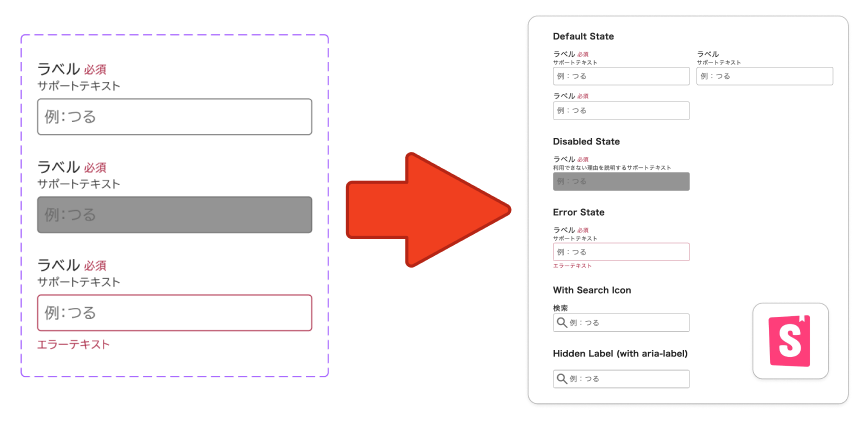

---

## Figma MCPの使用

Figmaのコンポーネントを作り込んでおくと結構な精度で再現できた。

- デザイントークンを使用していること
- バリアブルでコンポーネントの状態が定義されていること
- Auto Layout でレイアウトを組んでいること

---

## AI生成の精度を上げる上での課題

不要なhtmlやcssが生成される
→ コーディング上のルールを整備する必要がありそう

 

Figmaに定義している以上のものを生成する
（hover時のアニメーション、フォーカスインジゲーターなど）
→ デザイン上の暗黙的なルールを渡す必要がありそう

---

<!--  _class: strong -->

## 振り返りと今後

---

## 振り返り

### 信頼できる情報源ができた

- 無駄な開発が減ってシンプルに嬉しい
- デザインもかなりしやすくなった
- **勝手に作っただけなのでメンバーと一緒に育てていきたい**

---

## SSOTをどこに置くか

### Storybook集約という選択肢もあり

- サイボウズ社やSmartHR社もStorybook側に寄せているっぽい
- OriCubeはメンバーが全員エンジニアなので、Figmaは最低限でよさそう
- AIとの相性もいい（Claude Designとかも気になる）

---

<!--  _class: strong -->

## まとめ

デザインの基盤ができた！
今後もアップデートしていきたい！
