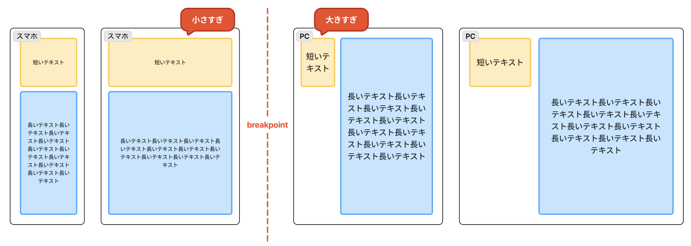
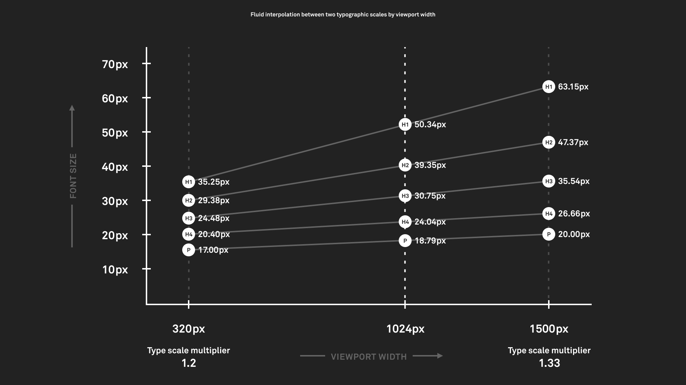
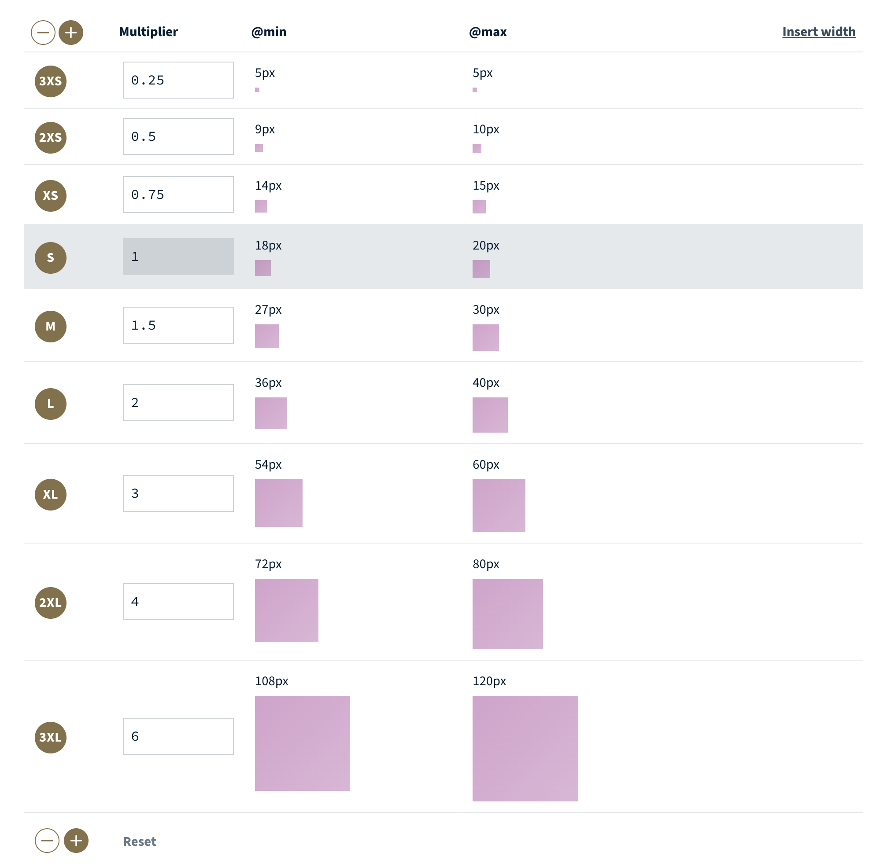

## はじめに

このポートフォリオサイトのタイポグラフィとスペーシングを、Utopia を使った**流体レスポンシブデザイン**（fluid responsive design）に移行しました。

この記事では、そもそも従来のレスポンシブデザインにどんな課題があったのか、Utopia と流体デザインがそれをどう解決するのか、そして実際にこのサイトへどう導入したのかをまとめます。

## 従来のブレイクポイントベースのレスポンシブデザインの課題

従来のレスポンシブデザインでは、ブレイクポイントを定義して、画面幅の区分ごとに文字サイズやスペーシングを切り替える手法が主流でした。しかしこの方法にはいくつかの課題が残ります。

### ブレイクポイント前後で視認性が落ちる

例えば「768px でスマホから PC に切り替える」という設定を考えます。

768px を少し下回る幅では、スマホ用の小さな文字が適用されます。しかしこの付近の画面はそれなりに広いので、文字が小さすぎるように感じます。逆に 768px を少し超えると PC 用の大きな文字に切り替わりますが、画面はまだ小さめなので、今度は文字が大きすぎるように感じます。このように、ブレイクポイントの前後どちらでも「レイアウトが最適化された状態から外れてしまう」という問題が起きます。



### 適切なブレイクポイントを増やすと工数が膨らむ

この違和感を解消しようとすると、「じゃあスマホと PC の間にタブレット用のブレイクポイントを足そう」という話になります。しかしブレイクポイントを増やしていくほど、デバイスの数だけ個別に開発するのに近い手間になり、デザインの工数もどんどん膨らんでいきます。

しかも、どれだけ細かく刻んでも変化は段階的なままで、画面幅に応じた連続的な変化にはなりません。

## 解決策: Utopia を使う

そこで導入したのが **[Utopia](https://utopia.fyi/)** です。

Utopia は「fluid responsive design（流体レスポンシブデザイン）についての考え方」で、フレームワークやライブラリではなく、**設計の考え方とそれを助ける計算ツール群**です。これを使うと、ブレイクポイントの定義を最小限に抑えつつ、画面幅に応じて滑らかに変化するレイアウトを表現できます。



## Utopia と流体デザインの概要

流体レスポンシブデザインには、文字を扱う**流体タイポグラフィ**（fluid type）と、余白を扱う**流体スペース**（fluid space）が含まれます。

考え方はシンプルで、従来のように「このビューポートからこのビューポートまではこのフォントサイズ」と区間ごとに固定値を決めるのではなく、

1. **モバイルサイズ**（例: 320px）でのサイズを決める
2. **PC サイズ**（例: 1440px）でのサイズを決める
3. その**間はブラウザに補間させる**

というものです。補間は画面幅に連動して滑らかに行われ、ビューポートが大きくなるほどフォントサイズも少しずつ大きくなります。境目でカクッと切り替わるのではなく、画面幅の変化に沿って連続的につながるイメージです。この連続的な変化のおかげで、「ブレイクポイント前後で視認性が落ちる」「変化が不連続になる」という課題がまとめて解消されます。

文字はひとつのサイズだけではなく、本文・見出しなどの階層があります。そこで**タイプスケール**（type scale）として階層を定義し、その各段のサイズは**モジュラースケール**（modular scale）、すなわち一定の比率から生成します。たとえば比率 1.2 なら、1 段上がるごとにサイズが 1.2 倍になっていきます。スペースも同じ考え方で、小さい画面・大きい画面それぞれの余白を決めれば間は補間され、決まったスペースはグリッド（カラムや溝）の設計にもつながっていきます。

## 具体的な実装方法

### clamp() で連続的に変化させる

実装は CSS の `clamp()` 関数を使います。`clamp()` は **最小値・基準値（preferred）・最大値** の 3 つを取ります。

```css
font-size: clamp(最小値, 基準値, 最大値);
```

- **最小値 / 最大値**: 下限と上限。これ以上小さく・大きくならない、というキャップです。
- **基準値（preferred）**: その間でどう変化させるかを表す値。ここにビューポート幅（`vw`）を使った式を入れることで、画面幅に応じて滑らかに変化します。

つまり、下限と上限で行きすぎを抑えつつ、その内側は画面幅に応じて連続的に動く、という仕組みです。スペースも同じように `clamp()` で表現できます。

ただ、この基準値をどう組み立てるかを手計算するのは大変です。そこで Utopia のサイトにある計算ツールを使います。ビューポートの最小・最大とフォントサイズ・比率などを入力すると、必要な `clamp()` の値を生成してくれます。type scale・space・grid それぞれに計算ツールが用意されています。


### このサイトへの導入

実際にこのポートフォリオでは、Utopia の計算ツールで生成した値を CSS カスタムプロパティとして持たせています。

タイプスケールは次の設定で生成しました。

- **最小**: ビューポート 320px / フォント 16px / 比率 1.2（Minor Third）
- **最大**: ビューポート 1440px / フォント 20px / 比率 1.25（Major Third）

これを `--step--2` 〜 `--step-6` のような段階として定義しています。

```css
:root {
  --step--1: clamp(0.8333rem, 0.7857rem + 0.2381vw, 1rem);
  --step-0: clamp(1rem, 0.9286rem + 0.3571vw, 1.25rem);
  --step-1: clamp(1.2rem, 1.0964rem + 0.5179vw, 1.5625rem);
  /* ... */
}

body {
  font-size: var(--step-0);
}
```

スペースも同様に、`--space-2xs` 〜 `--space-3xl` の T シャツサイズで fluid space scale を定義しています。

```css
:root {
  --space-s: clamp(1rem, 0.9286rem + 0.3571vw, 1.25rem);
  --space-m: clamp(1.5rem, 1.3929rem + 0.5357vw, 1.875rem);
  --space-l: clamp(2rem, 1.8571rem + 0.7143vw, 2.5rem);
  /* ... */
}
```

こうしておくと、各コンポーネントは `var(--step-1)` や `var(--space-m)` を参照するだけで済みます。値そのものは 1 か所にまとまっているので、レイアウト全体に一貫して流体的なスケールが効きます。

## まとめ

Utopia を導入して、このサイトのタイポグラフィとスペーシングを流体レスポンシブデザインに移行しました。ブレイクポイントで区間ごとに固定値を切り替えるのではなく、画面幅に連動して滑らかに変える。この発想の転換によって、ブレイクポイントを大量に定義する手間から解放されつつ、境目の違和感のない一貫したレイアウトを実現できました。
