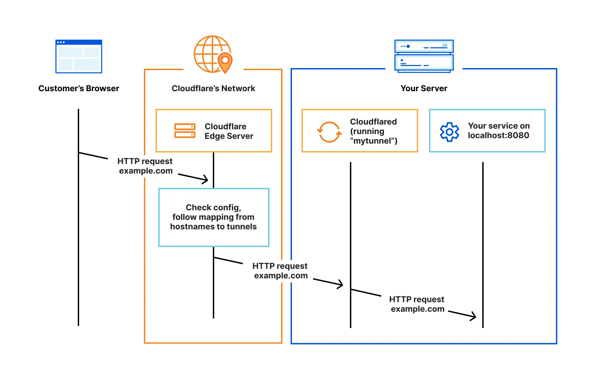

ポートフォリオにメモページを作成しました。ぜひご覧ください。

## メモページとは？

メモページは、yutteee(作者)の学習の記録を残すためのページです。インプットした知識を一覧で表示しています。

問いとその答えが1対1で対応した形式でそれぞれの知識は記述されています。UIはXのように一覧でスクロールできるUIになってます。また、継続して知識をインプットしていることを示すために、GitHubの草(コントリビューショングラフ)のようなUIも設けています。

### なぜメモページを作成したのか？

強いエンジニアになるために勉強をしないとなと思っていましたが、勉強が継続できませんでした。自分は誰かに見られている意識がないと怠けるところがあるので、勉強していることを何らかの形で人に見てもらう必要があると考えました。

ブログ記事を書くことを習慣化すると言うことも考えましたが、ハードルが高いと感じました。ブログを書くためには知識を入れる、考えをまとめる、記事を書くという流れがあると考えてますが、そもそも知識を入れる時点ができていない状況です。そのためブログを書くことの習慣化はまた挫折するだろうなと感じました。実際にポートフォリオの記事が少ないことを見ればわかりますね...。

そこでメモページを作成しました。自分で単語帳を作って公開しているようなものであり、アウトプットのハードルは低いです。そして学習を継続しているかどうかは一目でわかるようにしているので、勉強をサボっている姿は見せまいとして継続ができると考えました。

## 仕組みについて

Ankiという学習アプリに問題と答えを登録し、そのデータを取得して一覧で表示しています。

### Anki

Ankiは、分散学習を使用したフラッシュカードアプリです。最適化された復習のタイミングで出題してくれるため、学習した情報を効率的に覚えることができます。また、AnkiWebを用いるとモバイルとPCで同期することができます。

AnkiWebで同期をすることは可能ですが、APIなどは提供されていません。ローカルに作成されたフラッシュカードを公開するには自分で仕組みを作る必要がありました。

[AnkiConnect](https://ankiweb.net/shared/info/2055492159)というアドオンが役に立ちました。AnkiConnectを使用すると、Ankiが起動されるたびにローカルホストを起動します。これによって外部からHTTP APIを介してAnkiと通信が可能になります。カードデッキに対するクエリの実行や新しいカードの作成などが可能です。このローカルサーバーをAPIとして公開できれば良いと考えました。

<!-- 
- curl localhost:8765 -X POST -d '{"action": "deckNames", "version": 6}　#デッキを取得
- curl localhost:8765 -X POST -d '{"action": "findCards", "version": 6, "params": { "query": "deck:\u30de\u30b9\u30bf\u30ea\u30f3\u30b0TCP/IP"}}' #デッキ内にあるカードのidを取得
- curl localhost:8765 -X POST -d '{"action": "cardsInfo", "version": 6, "params": { "cards": [1742275371810]}}' #カードの詳細を取得

curl localhost:8765 -X POST -d '{"action": "findCards", "version": 6, "params": { "query": "added:0"}}'　これで何日前までに追加されたカードを取得することができる

queryについて詳しくはこちら
https://docs.ankiweb.net/searching.html

 -->

<!-- 
作成日時は表示できないと。
昨日の学習状況

単語帳を公開したいわけではない。それは自分で管理できるし、使われることを想定しているわけではない。

目的は、学習が継続できていることを示すということ
何を学習しているのかを示すということ

最高継続日数を書いておく、
継続できなかったら、過去のデータが消える
一度でもサボるとこのメモページから全てが消えるようになる

でもユーザー側は意味わからないか。

最高継続日数は書きたいねぇ。

過去30日分の結果を表示しておいて、最下部まで到達したら無限スクロールみたいにする？

理想を考えるな。アジャイルで最低要件を満たせ。
- 継続日数
- 直近勉強したことについて

日毎のデータを取得できないのがな、間接的にはやれるんだけれども。できなそうだな。

1. 1日前のデータを取得する
2. 2日前までのデータを取得する
3. 1日前のデータを削除して、
まぁいけるか
 -->

### Cloudflare Tunnel

Cloudflare Tunnelは、ローカルのサーバーをCloudflareのネットワークを介して安全に公開できるサービスです。通常、ローカルのサーバーを外部からアクセス可能にするには、グローバルIPアドレスを取得して公開する必要がありますが、その場合、外部からの攻撃を受けるリスクが伴います。Cloudflare Tunnelを使用すると、ローカルのサーバーとCloudflare間でアウトバウンド方式（サーバーからCloudflareへの一方向の接続）で安全に接続が確立されます。この方法では、グローバルIPを取得しなくても、Cloudflareのネットワークを介して外部のクライアントがローカルのサーバーにアクセスできるようになります。

<!--
え、でも、自分で独自ドメイン取得してたじゃん、あれは何？グローバルIP結局必要ってことではないのか？
この独自ドメインはクライアントがアクセスするためのドメイン(おそらく)。

年600円くらいで買えるし、買ってもいいかもしれない。
-->

### GitHub Actions

このポートフォリオはAstroで作成された静的ページをCloudFlareにデプロイしています。アクセスがあるたびにAPIを叩いてページを生成するとパフォーマンス上の懸念があるため、GitHub Actionsを利用して毎日24時にデータを取得してこのサイトをビルドするようにしました。